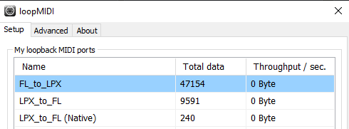
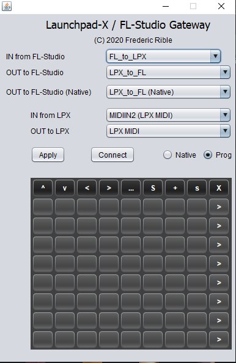
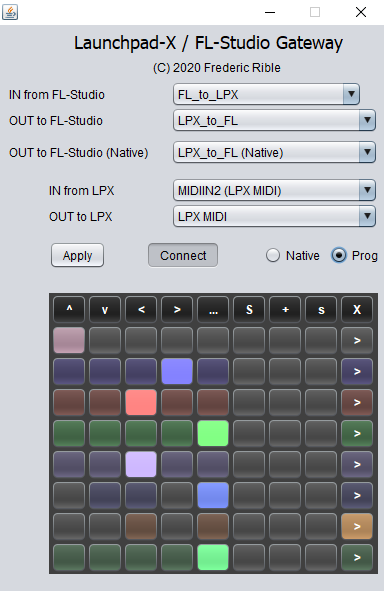

# Launchpad-X gateway for FL-Studio

Currently, the last Launchpad-X is not yet supported by FL-Studio 20.

I have developed a small Java application able to make it compatible with FL-Studio by converting Lauchpad-MK2 messages to Lauchpad-X format.

Tested only under Win10, but should work on other Windows versions, or MacOS.

You need to install a Virtual MIDI loopback software such as [https://www.tobias-erichsen.de/software/loopmidi.html](https://www.tobias-erichsen.de/software/loopmidi.html)

Then, setup three Virtual MIDI ports as below:

- "FL\_to\_LPX" port will transport MIDI commands from FL-Studio to the Lauchpad-X
- "LPX\_to\_FL" port will transport MIDI message from Lauchpad-X to FL-Studio (pads status)
- "LPX\_to\_FL (Native)" will do the same, but for native MIDI mode of the Launchpad-X (Note mode or Custom mode)

    [Launchpad-X\] <=== \[Java\] <=== FL\_to\_LPX <=== \[FL-Studio\]  
    [Launchpad-X\] ===> \[Java\] ===> LPX\_to\_FL ===> \[FL-Studio\]  
    [Launchpad-X\] ===> \[Java\] ===> LPX\_to\_FL (Native) ===> \[FL-Studio\]

    

Connect your Launchpad-X.

Then you need to install and run the Java application: [https://github.com/f1oat/Launchpad-X-gateway/raw/master/target/Launchpad-X-gateway-1.0-SNAPSHOT.jar](https://github.com/f1oat/Launchpad-X-gateway/raw/master/target/Launchpad-X-gateway-1.0-SNAPSHOT.jar)

Configure it as below:

   

If you have used the exact recommended names for loopMidi configuration, the Java application should select automatically the right ports. Otherwise, you will need to do it by hand by using the drop down menus, and click "Apply".

Before launching FL-Studio, you can now click on "Connect" button. As a result, all pads should now become dark. If not, that means you have a configuration problem.

Then, launch FL-Studio. You have to make the connection to the loopMidi virtual ports and declare a "Launchpad MK2" device as below:

- Input section
    - LPX\_to\_FL / Novation Launchpad MK2 / port 20
    - LPX\_to\_FL (Native) / generic controller / port 3 (or any value different from 20)
- Output section
    - FL\_to\_LPX / Novation Launchpad MK2 / port 20
    - LPX\_to\_FL / MIDI hardware port / port 19 (or any value different from 20 and 3)
    - LPX\_to\_FL (Native) / MIDI hardware port / port 18 (or any value different from 20 and 3)

   

Note:

- port 20 can be set to any other value, the only constraints is to have the same value both for input and output.
- port 18 and 19 will not be used by FL-Studio, but they should be declared so that FL-Studio does not automatically configure them for port 20 or 3 and disturb the system.

When everything is configured, you can load a performance mode song.  
You should see pads getting several colors according to the Playlist.  
Also, you should see the same colors on the Java application:

   

You can now play with your Launchpad-X. The behavior will be the same as for MK2. See description here: [https://forum.image-line.com/viewtopic.php?t=147179](https://forum.image-line.com/viewtopic.php?t=147179)

The "Native" radio button can be used to make the Lauchpad-X going back to power-on status, and send MIDI messages in "Note mode" or "Custom mode". MIDI messages will be received by FL-Studio on port 3 for our configuration example. When you are in native mode, you can no longer use the performance mode.

Enjoy!

## Compiling
To build from source you need [Gradle](https://gradle.org/). Once you have gradle installed
simply run `gradle wrapper` to obtain the correct version of Gradle, then `./gradlew build`
to build the project.